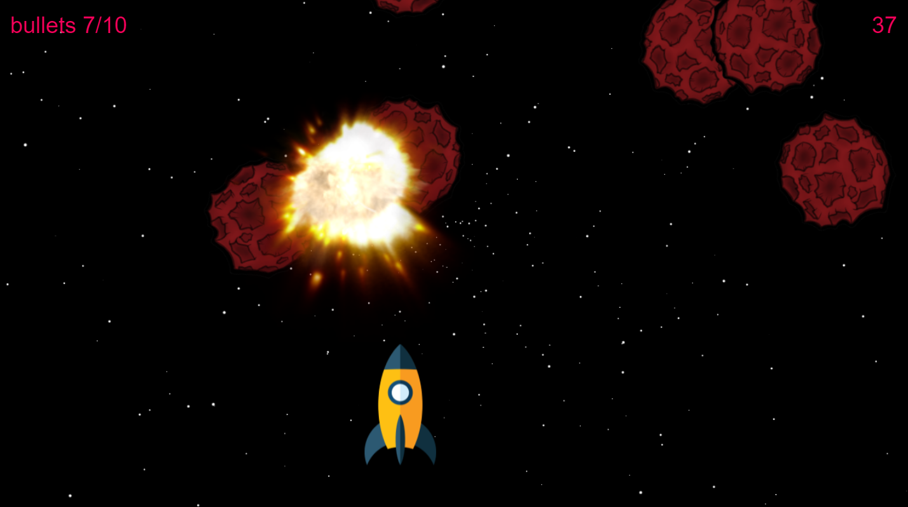

# Space Shooter Game

## Overview

Space Shooter is a simple arcade-style game where players control a spaceship, shoot asteroids, and battle a boss. The game is built using HTML, JavaScript/TypeScript, and the PIXI.js library for rendering graphics.



## Features

- **Spaceship Control:** Move left, right, and shoot.
- **Levels:** Two levels of difficulty, including a boss fight.
- **Timer:** Countdown timer for each level.
- **Explosions:** Visual effects for collisions with asteroids and boss destruction.
- **Bullet and Time Display:** Shows the number of bullets and remaining time.

## Requirements

- Node.js. Recommended version: `>=20.0.0`.
- npm

## Installation

1. Clone the repository:

   ```bash
   git clone https://github.com/ViktoriiaRepo/space-shooter.git
   ```

2. Navigate to the project directory:

   ```bash
   cd space-shooter
   ```

3. Install the dependencies:

   ```bash
   npm install
   ```

4. Start the project:

   ```bash
   npm start
   ```

   The project will automatically open in your browser at http://localhost:3000.

   ## Usage

- **Shooting:** Press the space bar.
- **Movement:** Use arrow keys or `a` (left) and `d` (right).
- **Game Over:** The game ends when time runs out or the player loses all lives.

## Development

- Modify files in the `src` directory to add new features or levels.
- Change the UI in `index.html` and styles in the `styles` directory.
